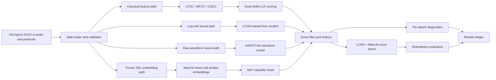

# Project Summary

This repository is a completed experiment snapshot for speech anti-spoofing on
ASVspoof 2019 Logical Access. It studies how classical cepstral
countermeasures, scratch-trained neural models, pretrained speech
representations, score fusion, and robustness evaluation behave under one
reproducible evaluation harness.

## Scope

The project answers three practical questions:

1. Which protocol-comparable model works best when trained only on ASVspoof
   2019 LA?
2. Do frozen pretrained speech representations provide useful spoofing cues?
3. Does the best clean-eval system remain reliable under realistic audio
   corruption?

The repository is not a leaderboard claim. It separates protocol-comparable
models from external-pretrained applied systems and avoids claiming SOTA without
matching challenge restrictions.

## Data And Evaluation

Dataset: ASVspoof 2019 Logical Access.

| Split | Total | Bonafide | Spoof | Attack IDs |
|---|---:|---:|---:|---|
| Train | 25,380 | 2,580 | 22,800 | A01-A06 |
| Dev | 24,844 | 2,548 | 22,296 | A01-A06 |
| Eval | 71,237 | 7,355 | 63,882 | A07-A19 |

Primary metric: eval Equal Error Rate (EER). Eval is the main split because it
contains unseen attack families. Accuracy is retained only as a secondary
diagnostic because the class distribution is imbalanced.

## System Architecture



## Accepted Results

| System | Track | Params | Dev EER | Eval EER | Role |
|---|---|---:|---:|---:|---|
| LFCC GMM-LLR | Protocol-comparable | n/a | 0.06% | 10.25% | strongest classical baseline |
| log-mel LCNN | Protocol-comparable | 665,153 | 0.75% | 5.67% | strongest scratch neural result |
| AASIST-lite waveform | Protocol-comparable | 137,828 | 2.59% | 10.64% | raw-waveform graph-attention baseline |
| frozen WavLM pooled MLP | External-pretrained/applied | 393,986 | 3.02% | 5.08% | best individual applied model |
| LCNN + WavLM score fusion | External-pretrained/applied | n/a | 0.55% | 3.62% | best numeric project result |

The strongest protocol-comparable system is the log-mel LCNN at 5.67% eval EER.
It improves over the published ASVspoof 2019 LFCC-GMM eval reference of 8.09%
by 2.42 percentage points and over the published CQCC-GMM eval reference of
9.57% by 3.90 percentage points.

The best numeric result is LCNN+WavLM score fusion at 3.62% eval EER. This is
external-pretrained/applied because WavLM uses external speech pretraining.

## Robustness Findings

Phase 5 evaluates frozen accepted systems under deterministic corruption. No
models are retrained, no normalization is refit on corrupted eval, and the
fusion rule remains frozen as:

```text
fused_score = 0.7 * z_lcnn + 0.3 * z_wavlm
```

| Condition | LCNN EER | WavLM EER | Fusion EER | Main Finding |
|---|---:|---:|---:|---|
| clean | 5.67% | 5.08% | 3.62% | fusion is strongest |
| clip 0.4 | 8.03% | 5.74% | 6.13% | WavLM handles heavy clipping better |
| resample 8 kHz | 7.57% | 4.72% | 5.79% | WavLM is most stable |
| noise 20 dB | 16.48% | 11.45% | 15.48% | noise starts to dominate errors |
| noise 10 dB | 34.49% | 21.62% | 36.53% | WavLM is most noise-robust |
| noise 5 dB | 41.22% | 38.55% | 39.80% | all systems degrade severely |

The clean-eval conclusion and robustness conclusion are different. Fusion gives
the best clean unseen-attack EER, while WavLM is safer under additive noise and
some stronger channel shifts.

## Evidence Files

The compact committed evidence is:

- `results.md`
- `results/neural/metrics/lcnn_logmel_full_seed42_30ep_summary.json`
- `results/neural/metrics/aasist_lite_waveform_seed42_100ep_summary.json`
- `results/neural/metrics/ssl_wavlm_pooled_full_seed42_50ep_summary.json`
- `results/fusion/metrics/lcnn_wavlm_score_fusion_seed42_summary.json`
- `results/robustness/metrics/phase5_eval_corruptions_summary.json`

Large audio, checkpoints, raw scores, embedding caches, and full robustness run
folders are intentionally excluded from git.

## Current State

The project is complete as a benchmark and robustness study. The next stage,
if pursued, should be framed as research extension rather than cleanup: for
example, robustness-aware fusion, noise/channel augmentation, calibration under
corruption, or deployment-oriented audio constraints.
