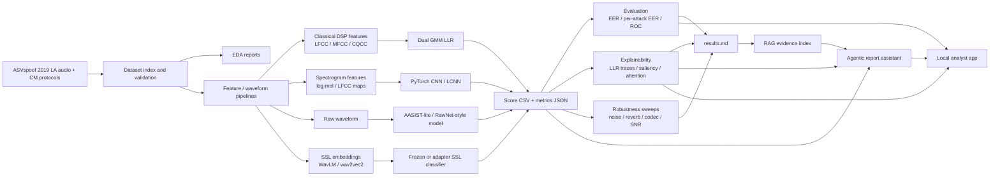
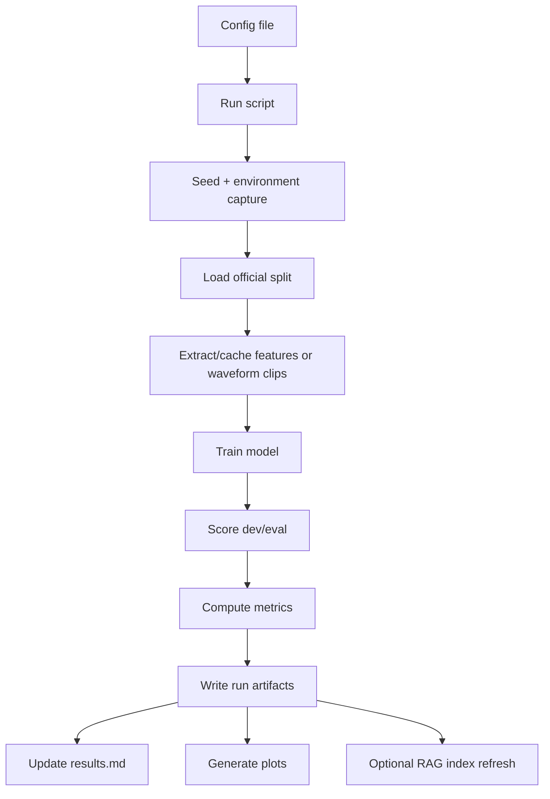

# Project Plan: Audio Deepfake Detection and Forensics Workbench

This file is the project control document. It records the agreed scope,
architecture, evaluation rules, implementation order, and handoff expectations
for this repository. Update it when decisions change.

## Mission

Build a reproducible audio ML system for speech spoofing and audio deepfake
forensics. The project should demonstrate:

- classical audio DSP countermeasures
- PyTorch spectrogram and waveform neural models
- graph-attention anti-spoofing concepts
- self-supervised speech embeddings
- robustness/data-generation experiments
- explainability for model decisions
- a grounded agentic/RAG reporting layer
- a local analyst-facing display app

The project is aimed at audio ML, perception, CV-adjacent, and applied ML
internship roles. It should not become a generic app project or an unstructured
leaderboard chase.

## Fixed Decisions

| Area | Decision |
|---|---|
| Dataset | ASVspoof 2019 Logical Access is the canonical dataset. |
| Primary metric | Eval EER is the headline metric. Dev EER is diagnostic. |
| Secondary metrics | per-attack EER, ROC/AUC, score distributions, model size, latency, robustness delta EER. |
| Results source of truth | Root `results.md` is the human-readable ledger. JSON/CSV artifacts remain machine-readable evidence. |
| Challenge comparability | Keep protocol-comparable and external-pretrained/applied results labeled separately. |
| Compute | Use Colab Pro GPU for neural training; use Mac/local for smoke tests, docs, app, RAG, plotting, and ONNX inference. |
| SSL approach | Start with frozen WavLM/wav2vec2 embeddings; later compare adapters/LoRA or top-layer fine-tuning. |
| LLM approach | Use deterministic local retrieval first; optionally use OpenAI/Grok only to summarize retrieved evidence. |
| Cloud | Not required. Local app plus reproducible scripts are higher priority. |
| App scope | Local analyst/workbench demo, not production cloud deployment. |
| Security posture | No dataset, keys, checkpoints, model weights, caches, or score files committed unless intentionally lightweight and anonymized. |

## Evaluation Tracks

### Track A: Protocol-Comparable

Use ASVspoof train/dev/eval and avoid external pretrained speech encoders.
These results can be compared most cleanly to classical ASVspoof baselines.

Models:

- LFCC-GMM, MFCC-GMM, CQCC-GMM
- log-mel CNN / LCNN
- AASIST-lite trained from ASVspoof audio
- optional RawNet2-style waveform baseline

### Track B: Applied Modern System

Use external pretrained models or product-oriented components. These results
are useful for applied audio ML roles, but must be labeled as not strictly
challenge-comparable.

Models/components:

- frozen WavLM/wav2vec2 embedding classifier
- top-layer/adapters/LoRA fine-tuning
- robustness-trained models
- ONNX inference
- RAG/agentic reporting assistant
- local analyst app

## Current State

Completed:

- ASVspoof 2019 LA protocol loader
- EDA pipeline
- LFCC/MFCC/CQCC frame features
- dual-GMM log-likelihood-ratio scoring
- feature caching
- metrics, plots, per-attack analysis
- comparison against published LFCC-GMM and CQCC-GMM references
- reproducible Makefile/config workflow
- smoke tests and unit tests

Current best result:

- LFCC GMM-LLR: 0.06% dev EER, 10.25% eval EER

See `results.md` for the authoritative results ledger.

## System Architecture



## Experiment Data Flow



Every run should write:

```text
results/<track>/<run_id>/
├── config.json or config.yaml
├── environment.json
├── metrics.json
├── per_attack.csv
├── plots/
├── model_card.md
└── scores.csv              # ignored if large
```

For current classical runs, the existing `results/baseline/` layout is kept for
continuity.

## Phases

### Phase 0: Project Control and Neural Infrastructure

Goal: prepare the repository for parallel neural-model work without losing
reproducibility.

Tasks:

- Add `plan.md` and root `results.md`.
- Define architecture and interdependencies with Mermaid diagrams.
- Add neural requirements file. Done: `requirements-neural.txt`.
- Add config convention for neural runs. Done: `configs/neural_lcnn*.json`.
- Add run registry structure. Done: `results/neural/.gitkeep` and `results/runs/.gitkeep`.
- Add model-card template. Done: `docs/model_card_template.md`.
- Add Colab handoff instructions. Done: `docs/colab_handoff.md`.
- Add tests for neural dataset shapes once implemented.
- Keep result outputs standardized and graphable.

Exit criteria:

- Future agents can identify the next task from `plan.md`.
- Current results are visible in `results.md`.
- New runs have a clear artifact contract.

### Phase 1: PyTorch Spectrogram Countermeasure

Goal: add a clear PyTorch audio deep learning baseline.

Model candidates:

- log-mel CNN
- LFCC-LCNN or LCNN-style network

Inputs:

- fixed-length crop/pad audio
- log-mel or LFCC feature maps

Metrics:

- dev/eval EER
- per-attack EER
- ROC
- score distribution
- model size and inference latency if easy

Exit criteria:

- Full dev/eval run completed.
- Results added to `results.md`.
- Plots generated.
- README updated with neural comparison.

### Phase 2: Waveform and Graph-Attention Countermeasure

Goal: cover raw waveform and graph attention methods.

Model candidates:

- AASIST-lite inspired model
- optional RawNet2-style baseline if useful

Metrics:

- same as Phase 1
- parameter count
- training time

Exit criteria:

- AASIST-lite result compared against LFCC-GMM and spectrogram CNN.
- Architecture and implementation clearly documented.

### Phase 3: SSL Embedding Countermeasure

Goal: add a modern external-pretrained speech model track.

Approach:

- frozen WavLM/wav2vec2 embeddings first
- cache embeddings
- train shallow classifier or attentive pooling head
- later compare top-layer fine-tuning, adapters, or LoRA

Validity rule:

- Label these as applied/external-pretrained results, not protocol-comparable
  ASVspoof challenge results.

### Phase 4: Robustness and Synthetic Data Generation

Goal: simulate real-world acoustic stress.

Perturbations:

- background noise at controlled SNR
- reverb / room impulse response
- codec compression
- gain shifts
- bandwidth limitation

Metrics:

- clean EER
- corrupted EER
- delta EER
- per-attack changes

### Phase 5: Explainability

Goal: explain why models make spoof/bonafide decisions.

Methods:

- GMM frame-level LLR traces
- CNN Grad-CAM or saliency on log-mel/LFCC spectrograms
- AASIST attention visualization if reliable
- WavLM attention/embedding caveats documented carefully

Outputs:

- per-sample explanation figure
- per-attack failure notes

### Phase 6: Agentic/RAG Reporting Assistant

Goal: build a grounded assistant for experiment and forensics reporting.

Assistant responsibilities:

- retrieve metrics and plots
- compare runs
- explain failure modes
- generate reports from evidence
- refuse to invent missing metrics
- distinguish protocol-comparable vs external-pretrained results

Implementation rule:

- Retrieval and tool outputs are deterministic.
- LLM/API layer summarizes retrieved evidence only.

### Phase 7: Local Analyst App

Goal: make the project easy to inspect.

Views:

- upload audio
- model score and threshold
- waveform/spectrogram
- saliency or LLR trace
- per-run comparison dashboard
- assistant-generated report

Non-goal:

- cloud production deployment.

## Milestones for Applications

### Bose-Ready Milestone

Scope:

- Phase 0 complete
- Phase 1 complete
- Phase 2 first AASIST-lite or waveform result

Resume signal:

- audio DSP
- PyTorch
- spectrogram neural modeling
- waveform/graph attention method
- rigorous ASVspoof comparison

Estimated time:

- 10-18 focused days with Colab Pro GPU

### Tesla-Ready Milestone

Scope:

- Bose-ready scope
- Phase 4 robustness/data generation
- ONNX/local inference if practical
- initial explainability

Resume signal:

- automated data generation
- diagnostics
- production-style inference
- robustness under real-world acoustic conditions

Estimated time:

- additional 10-14 focused days

### Final Portfolio Milestone

Scope:

- Phases 0-7 complete
- final README, app screenshots, model cards, and report examples

Estimated time:

- 4-6 total weeks for a strong version
- 6-8 total weeks for a highly polished version

## Reproducibility Rules

- All experiments must be config-driven.
- Every script must support deterministic seed control where applicable.
- Store raw dataset under `data/`, never in git.
- Store large caches/checkpoints/scores under ignored paths.
- Commit lightweight metrics, summaries, selected plots, and configs.
- Report exact split names and whether external pretraining was used.
- Do not tune on eval repeatedly. Use eval for final reporting.
- Add smoke runs before full Colab runs.
- Add tests for metrics, feature shapes, dataloading, and output schemas.

## Validity Rules

- EER is computed from continuous scores, not binary predictions.
- Accuracy is secondary because ASVspoof splits are class-imbalanced.
- Eval is the primary generalization result.
- Per-attack EER is required for unseen attack diagnosis.
- WavLM/wav2vec2 results must be labeled external-pretrained.
- Augmented robustness results must not replace clean ASVspoof eval.
- Do not claim SOTA unless the exact protocol, data, and restrictions match a
  published benchmark.

## Security and Privacy Rules

- Do not commit dataset audio.
- Do not commit API keys or `.env` files.
- Do not commit OpenAI/Grok prompts containing private credentials.
- Do not commit large model weights unless intentionally released.
- Do not expose local absolute paths in public docs except transient local
  development notes.
- The RAG assistant must cite local evidence files and avoid unsupported claims.

## Documentation Rules

- `README.md`: polished public project overview.
- `plan.md`: project roadmap and architecture decisions.
- `results.md`: authoritative human-readable results ledger.
- `results/**/metrics/*.json`: machine-readable evidence.
- `results/**/summary/`: generated tables and plots.
- each major model should have a short model card before being presented.

## Agent Handoff Rules

Parallel agents should:

- read `plan.md`, `results.md`, and `README.md` first
- work in a bounded file/module area
- avoid changing result claims without updating `results.md`
- avoid deleting archive files
- run tests or smoke checks for touched code
- record new metrics with the run command and config path
- keep protocol-comparable and applied/external-pretrained results separated

## Near-Term Implementation Checklist

- [x] Classical LFCC/MFCC/CQCC GMM pipeline
- [x] Feature cache
- [x] EDA and baseline plots
- [x] Root project plan
- [x] Root results ledger
- [x] Neural requirements file
- [x] Neural config template
- [x] Run artifact contract
- [x] Run registry scaffold
- [x] Model-card template
- [x] Colab handoff script/instructions
- [ ] PyTorch ASVspoof dataset module
- [ ] Log-mel feature transform
- [ ] CNN/LCNN model
- [ ] Neural training script
- [ ] Neural evaluation script
- [ ] Phase 1 smoke run
- [ ] Phase 1 full dev/eval run
