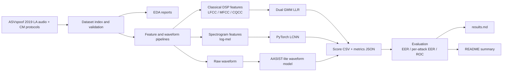
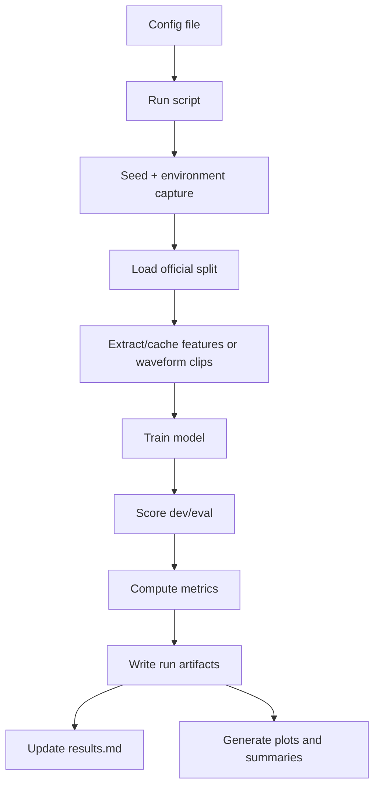

# Project Plan: Speech Anti-Spoofing on ASVspoof 2019 LA

This document records the completed project scope, architecture, evaluation
rules, and reproducibility expectations for the repository.

## Mission

Build a reproducible audio ML system for speech spoofing and audio deepfake
detection on ASVspoof 2019 Logical Access. The completed project demonstrates:

- classical audio DSP countermeasures
- PyTorch spectrogram neural modeling
- raw-waveform graph-attention modeling
- reproducible experiment configuration
- full dev/eval scoring on official ASVspoof splits
- per-attack diagnostics for unseen spoofing systems
- comparison against published ASVspoof reference baselines

The project is scoped as an audio ML benchmark and forensics workflow, not a
generic app or leaderboard-only experiment.

## Fixed Decisions

| Area | Decision |
|---|---|
| Dataset | ASVspoof 2019 Logical Access |
| Primary metric | Eval EER |
| Secondary metrics | Dev EER, per-attack EER, ROC, score distributions, model size, training time |
| Results source of truth | Root `results.md` plus machine-readable JSON/CSV artifacts |
| Challenge comparability | All reported headline models avoid external pretrained speech encoders |
| Compute | Local Mac for smoke tests/docs; Colab GPU for full neural training |
| Hyperparameter search | Use controlled configs; do not tune on eval |
| Storage policy | Keep dataset audio, checkpoints, score files, and large caches out of git |

## Phase 3 Extension: External-Pretrained SSL Track

Planned but not yet reported as a result:

- frozen `microsoft/wavlm-base-plus` encoder
- pooled mean+std cache from `last_hidden_state`
- train-only feature normalization
- weighted-cross-entropy MLP classifier
- strict track label: external-pretrained/applied, not protocol-comparable

This track tests representation transfer from a pretrained speech model. It
must be discussed separately from protocol-comparable ASVspoof challenge
systems because the encoder uses external pretraining.

## Completed Scope

Implemented and validated:

- ASVspoof 2019 LA protocol loader
- EDA pipeline
- LFCC, MFCC, CQCC, and WCQCC frame features
- dual-GMM log-likelihood-ratio scoring
- feature caching
- metrics, plots, score CSVs, and per-attack analysis
- comparison against published LFCC-GMM and CQCC-GMM references
- reproducible Makefile/config workflow
- smoke tests and unit tests
- PyTorch dataset, log-mel transform, and LCNN training pipeline
- raw-waveform crop/pad path
- AASIST-lite inspired waveform model
- Colab handoff workflow for GPU training and artifact archival

## Completed Results

| Model | Input | Params | Dev EER | Eval EER | Role |
|---|---|---:|---:|---:|---|
| LFCC GMM-LLR | LFCC + deltas | n/a | 0.06% | 10.25% | strongest classical baseline |
| CQCC GMM-LLR | CQCC | n/a | 11.15% | 11.59% | protocol-correct CQCC comparison |
| MFCC GMM-LLR | MFCC | n/a | 9.77% | 16.41% | MFCC ablation |
| log-mel LCNN | log-mel spectrogram | 665,153 | 0.75% | 5.67% | strongest project result |
| AASIST-lite waveform | raw waveform | 137,828 | 2.59% | 10.64% | waveform graph-attention baseline |

Best result:

- `lcnn_logmel_full_seed42_30ep`
- 5.67% eval EER
- trained from scratch on ASVspoof LA
- no external pretraining
- better eval EER than published LFCC-GMM and CQCC-GMM reference baselines

See `results.md` for run commands, per-attack EER, and evidence paths.

## System Architecture



## Experiment Data Flow



Every major run writes or archives:

```text
results/<track>/<run_id>/
├── config.json or config.yaml
├── environment.json
├── metrics.json
├── per_attack.csv
├── plots/
├── model_card.md
└── scores.csv
```

Large checkpoints, datasets, caches, and raw score files are excluded from git.
Compact summaries are committed under `results/**/metrics/`.

## Reproducibility Rules

- Experiments are config-driven.
- Split names, feature settings, model settings, and seeds are recorded.
- EER is computed from continuous scores, not binary predictions.
- Eval EER is the primary generalization claim.
- Dev EER is diagnostic and used for checkpoint selection.
- Per-attack EER is required because eval contains unseen attack families.
- Accuracy is secondary because ASVspoof splits are class-imbalanced.
- Full neural runs are archived from Colab before disconnecting the runtime.

## Validation Checklist

- [x] Classical LFCC/MFCC/CQCC GMM pipeline
- [x] Feature cache
- [x] EDA and baseline plots
- [x] Root results ledger
- [x] Neural requirements file
- [x] Neural configs
- [x] Run artifact contract
- [x] Model-card template
- [x] Colab handoff instructions
- [x] PyTorch ASVspoof dataset module
- [x] Log-mel feature transform
- [x] LCNN model
- [x] AASIST-lite waveform model
- [x] Neural training script
- [x] Neural evaluation script
- [x] Local smoke runs
- [x] Full LCNN dev/eval run
- [x] Full AASIST-lite dev/eval run
- [x] README and results ledger updated with final metrics
